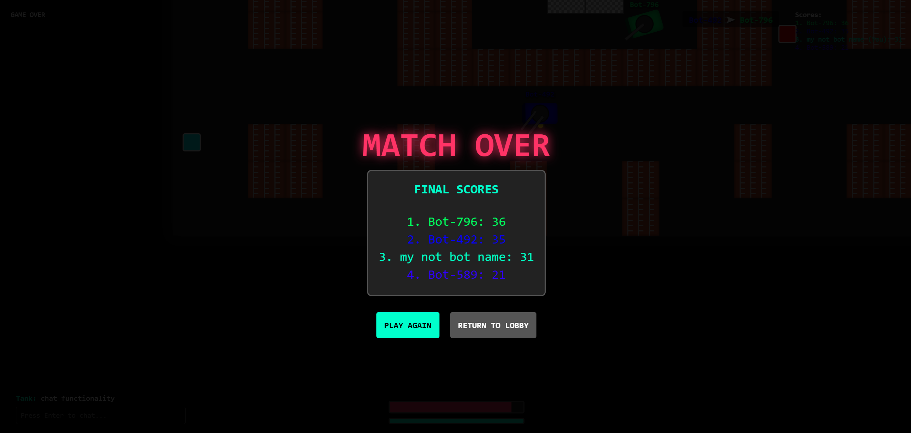
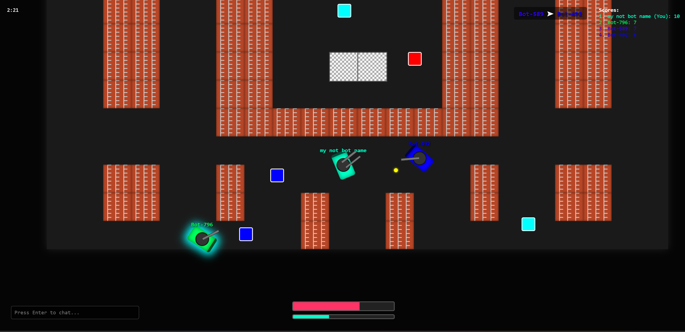
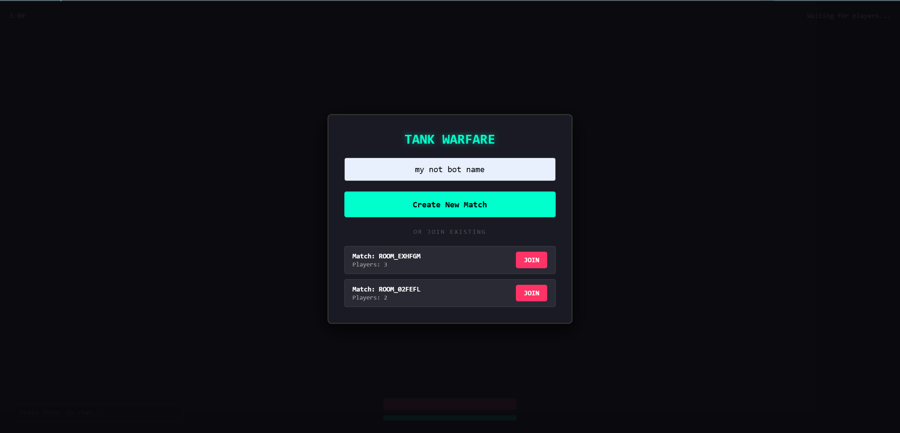

# Tank Warfare (ehh shooter)

Багатокористувацький 2D-шутер на танках з підтримкою кімнат (лобі), системою бонусів (power-ups) та AI-ботами. Проєкт побудовано на клієнт-серверній архітектурі з використанням веб-сокетів для синхронізації ігрового процесу в реальному часі.

## Скріншоти


_Меню створення та пошуку кімнат_


_Геймплей_


_Екран завершення матчу_

## Стек технологій

- **Backend:** Node.js, Express
- **Мережа:** Socket.IO (обмін даними в реальному часі)
- **Frontend:** HTML5, CSS3, Vanilla JavaScript (без використання фреймворків)
- **Рендеринг:** DOM-маніпуляції. Замість класичного `<canvas>`, гра використовує оптимізовані CSS-трансформації (`transform: translate3d()`, `will-change: transform`) для апаратного прискорення та плавного переміщення сутностей.
- **Аудіо:** Web Audio API (реалізація просторового 3D-звуку для позиціонування пострілів на карті).

## Як це працює (Архітектура)

Гра працює за моделлю **Авторитетного сервера (Authoritative Server)**. Це означає, що клієнт є "тонким": він не приймає жодних рішень, а лише відправляє команди користувача і малює те, що наказує сервер.

1. **Серверна логіка (`server/`)**:
    - **Game Loop:** Ігровий цикл працює на сервері із заданою частотою (Tick Rate). Він прораховує фізику, рух, колізії зі стінами (стіни з цегли та сталі) та влучання снарядів.
    - **AI Боти (`npc.js`):** Якщо в лобі не вистачає реальних гравців, сервер автоматично додає ботів. Боти керуються машиною станів (State Machine) і вміють: патрулювати карту (`WANDER`), переслідувати бонуси (`PURSUE_RELIC`), атакувати цілі в полі зору (`ATTACK`) та тікати, якщо у них мало здоров'я (`FLEE`).
    - **Broadcasting:** Кожного ігрового тіку сервер формує `state_update` (координати гравців, снарядів, стан бонусів) і розсилає його всім клієнтам у відповідній кімнаті.

2. **Клієнтська логіка (`public/`)**:
    - **Input Controller (`input.js`):** Відстежує натискання клавіш (WASD) та координати миші. Регулярно відправляє ці дані на сервер.
    - **State Manager (`state.js`):** Приймає та зберігає останній "знімок" стану гри від сервера.
    - **Renderer (`render.js`):** Використовує `requestAnimationFrame` для безперервного оновлення DOM. Щоб уникнути витоків пам'яті (Memory Leaks), для снарядів реалізовано систему Object Pooling — DOM-елементи куль не створюються/видаляються постійно, а перевикористовуються, змінюючи лише свої координати та стан видимості.

3. **Спільні дані (`shared/`)**:
    - Файл `constants.js` підключається і на сервері, і на клієнті. Він гарантує, що розміри карти, швидкість гравців, кулдауни та шкода від куль є ідентичними по обидва боки, що унеможливлює розсинхронізацію розрахунків.

## Особливості

- **Мультиплеєр:** Створення власних кімнат та приєднання до існуючих.
- **Система Power-ups:** Реліквії (зцілення + очки), Прискорення (Speed), Подвійний ствол (Double Barrel) та Щит (Shield).
- **Чат та Kill Feed:** Внутрішньоігровий чат та лог вбивств у реальному часі.
- **Динамічна камера:** Камера завжди центрується на танку гравця.
- **Просторове аудіо:** Гучність та панорамування звуків залежать від відстані між гравцем та джерелом звуку на карті.

## Структура проєкту

```text
ehh shooter
├── package.json    # Node залежності (express, socket.io)
├── screenshots/    # Скріншоти геймплею
├── shared/         # Спільний код для клієнта та сервера
│   └── constants.js  # Розміри карти, швидкість об'єктів, шкода, тощо
├── server/         # Авторитетний бекенд
│   ├── server.js     # Точка входу: налаштування Express та Socket.io, маршрутизація лобі
│   ├── game.js       # Головний ігровий цикл (фізика, колізії, спавн)
│   ├── player.js     # Структура даних гравця (координати, здоров'я, бафи)
│   ├── npc.js        # Логіка штучного інтелекту ботів (Raycasting, State Machine)
│   └── projectile.js # Логіка польоту куль
└── public/         # Клієнтська частина (браузер)
    ├── index.html    # DOM структура (меню, scoreboard, арена)
    ├── css/
    │   └── style.css # Стилізація UI та абсолютне позиціонування ігрових сутностей
    ├── sounds/       # Аудіо ассети (Web Audio API)
    └── js/
        ├── main.js   # Ініціалізація Socket.io та обробка основних подій сервера
        ├── input.js  # Зчитування дій гравця (клавіатура, миша)
        ├── state.js  # Зберігання поточного стану гри
        ├── audio.js  # Рушій просторового 3D-звуку
        ├── ui.js     # Керування меню, чатом, сповіщеннями
        └── render.js # Оновлення позицій DOM-елементів (transform) на основі state.js
```

# Запуск проєкту

1. Встановіть залежності

```bash
npm install
```

2. Запустіть сервер:

```bash
npm run run
```

3. Приєднуйтесь в гру

```bash
http://localhost:3000
```
